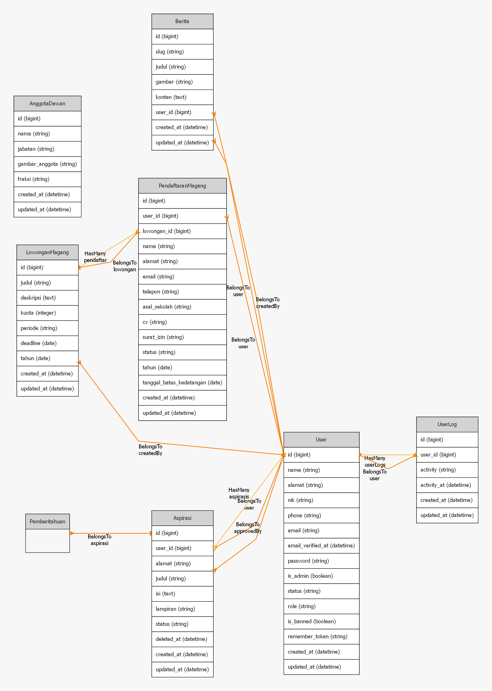

  

<h1 align="center">🏛️ SIPEDULI – Sistem Pelayanan Publik DPRD Kota Tegal</h1>

  <b>SIPEDULI</b> (Sistem Pelayanan Publik) adalah aplikasi berbasis <b>Laravel 10</b> yang digunakan untuk memfasilitasi masyarakat dalam menyampaikan <b>aspirasi, pengaduan, dan permintaan informasi</b> kepada DPRD Kota Tegal secara online, transparan, dan terstruktur.

  
  
  
  

---

## 📌 Tentang Proyek

SIPEDULI dirancang sebagai solusi digital pelayanan publik untuk meningkatkan:
- **Transparansi**
- **Efisiensi pelayanan**
- **Partisipasi masyarakat**

Aplikasi ini mengadopsi konsep sistem seperti **LAPOR!** dan dikembangkan sebagai proyek berbasis web menggunakan framework Laravel.

---

## ✨ Fitur Utama

### 👥 Masyarakat
- 📝 Pengajuan **Aspirasi**
- 📢 **Pengaduan** layanan publik
- ℹ️ **Permintaan Informasi**
- 📎 Upload lampiran (surat, dokumen pendukung)
- 🔍 Monitoring status laporan (diproses / diterima / ditolak)

### 🧑‍💼 Admin / DPRD
- 📊 Dashboard monitoring laporan masuk
- 📂 Manajemen data laporan masyarakat
- 🗂️ Klasifikasi laporan (Aspirasi / Pengaduan / Informasi)
- 🔄 Update status laporan
- 📥 Download file lampiran laporan

## 🚀 Instalasi

Ikuti langkah-langkah berikut untuk menjalankan aplikasi secara lokal:

### 1️⃣ Clone Repository
git clone https://github.com/alerascal/pelayanapubliktegal.git
### 2️⃣ Masuk ke Folder Proyek

cd pelayanapubliktegal

### 3️⃣ Install Dependency Backend
composer install

### 4️⃣ Install Dependency Frontend
npm install && npm run dev

### 5️⃣ Copy File Environment
cp .env.example .env

### 6️⃣ Generate Application Key

php artisan key:generate

### 7️⃣ Konfigurasi Database

Sesuaikan konfigurasi database di file `.env`:
DB_CONNECTION=mysql
DB_HOST=127.0.0.1
DB_PORT=3306
DB_DATABASE=sipeduli_db
DB_USERNAME=root
DB_PASSWORD=

### 8️⃣ Migrasi Database
php artisan migrate

### 9️⃣ Jalankan Server
php artisan serve

## ⚙️ Teknologi yang Digunakan

* Laravel 10
* PHP 8.x
* MySQL
* Bootstrap (Stisla Admin Template)
* JavaScript
* Blade Template Engine
## 🗺️ Roadmap Pengembangan

* [x] Sistem aspirasi & pengaduan masyarakat
* [x] Upload file lampiran laporan
* [x] Dashboard admin DPRD
* [ ] Notifikasi email laporan
* [ ] Export laporan ke PDF / Excel
* [ ] Tracking laporan real-time
* [ ] Integrasi API pelayanan publik
## 👤 Author

**Moh Sahrul Alam Syah**
📍 Mahasiswa / Web Developer
📧 Email: **[alerascal77@gmail.com](mailto:alerascal77@gmail.com)**
🔗 GitHub: [https://github.com/alerascal](https://github.com/alerascal)

## 📄 Lisensi

Proyek ini dikembangkan untuk keperluan **pendidikan dan pengembangan sistem pelayanan publik**.
Template admin menggunakan **Stisla** dengan lisensi **MIT**.

⭐ Jika repository ini bermanfaat, silakan berikan **star** untuk mendukung pengembangan proyek ini.

## 🔥 Setelah Ini
Jalankan:
git add README.md
git commit -m "Update README SIPEDULI yang lebih profesional"
git push
